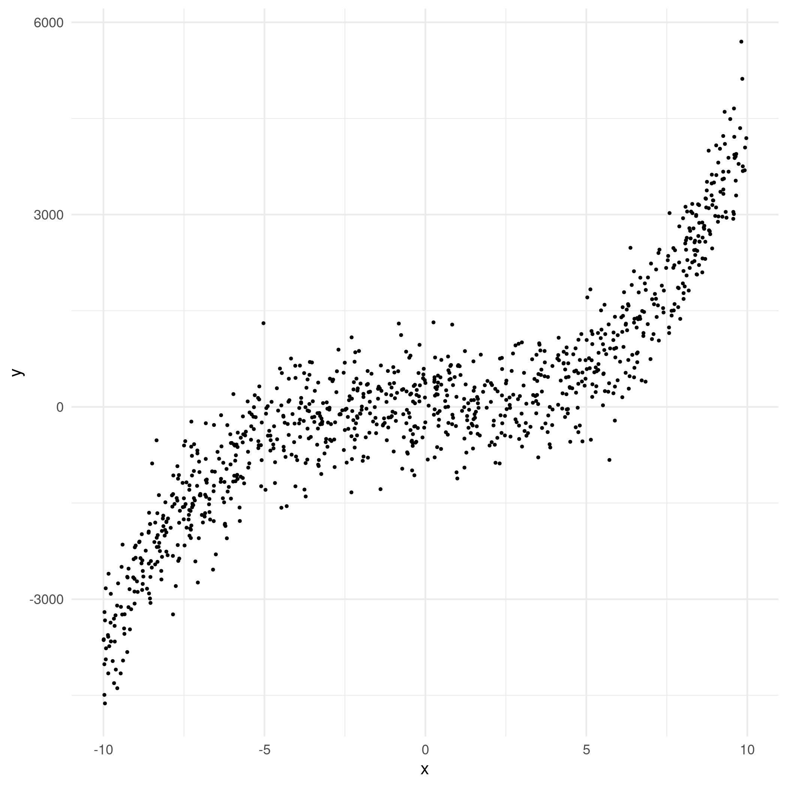

I wanted to explore making PyTorch models from scratch. 

Many tutorials ignore tabular data or if tabular data is used there are layers of abstraction which I do not find useful as someone wanting to research various NN architectures as a hobby.

This is a reference project that contains bite sized sample scripts.

This most interesting scripts are those which predict y using a polynomial x as an input.

$$ y = x + x^2 + x^3 + e $$

Here is what the raw data looks like

Here is a regression line fit through the data

Here is a regression line fit with a PyTorch line added (dotted red)

Finally, I like to make sure I can get back to some statistics. I add confidence intervales here. I did this simply by

$$ \hat{y} \pm [1.96, 1.00]$$

